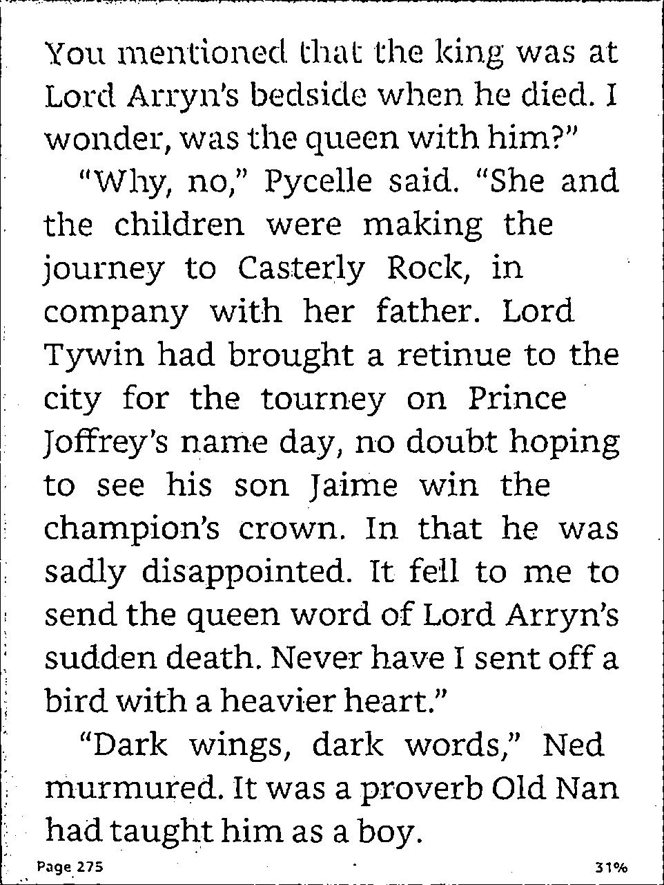

# Document Scanner

## Features

- [X] Image scanner  
- [ ] OCR based text reader
- [ ] Document summarizer

<br>

---

<br>

## 1. Image Scanner

<p align="left">

</p>

The [docscanner.py](./docscanner.py) script consists of the following pipeline steps:

0. Reading input
1. Grayscale conversion
2. Blurring
3. Edge detection
4. Contours searching
5. Largest Contour identification
6. Warping
7. Adaptive thresholding

### 1.1 Grayscale

* Conversion to grayscale enables us to work on only one channel, since for the time having coloured output isn't our focus.

* Also, we do not require colours in order to perform the essential tasks like contour detection and final processing.

### 1.2 Blurring

<p align="left">

</p>

* The main reason behind blurring is to remove the intricate details which are not required for the time being. This might seem counter intuitive, but the idea is to focus on the macro details rather than micro in order to obtain the larger details like the different shapes present in the image.
* This also enables us to ignore potential noises in the image.
* Gaussian blurring was used in this case.
    * Involves convolving with Gaussian function
    * Low pass filter


### 1.3 Edge detection

* Canny edge detection was used

    ```py
    img_threshold = cv2.Canny(img_blur, 100, 200)
    ```
    * 100 and 200 being `threshold1` (minVal) and `threshold2` (maxVal) values

* Canny edge detection theory  
    The steps can be summarized as follows:
    * Gaussian filter is used to remove noise from the image
    * The resultant smoothened image is passed through Scharr filters to obtain
    directional derivatives.

        * $Edge\_Gradient \; (G) = \sqrt{G_x^2 + G_y^2}$
        * $Angle \; (\theta) = \tan^{-1} \bigg(\frac{G_y}{G_x}\bigg)$

    * Fine thin edges are removed by the usage of Non-Maximum Suppression (NMS)
    * Finally, Hysteresis Thresholding is done.

* Dilation was applied after this in order to enhance the edges.
    ```py
    img_threshold = cv2.dilate(img_threshold, kernel, iterations=2)
    ```
    * Dilation is important to increase the visibility as well as ensure the continuity of the shapes detected, which would be useful in the next step of contour detection.

        <p align="left">
        
        </p>

    * On the left figure (without dilation), we can see that edges are so thin and often non-continuous. Dilation basically increases the thickness by convolving the image with a kernal filter, which replaces a pixel with a brighter pixel's value if it's present in its neighbourhood.


### 1.4 Contour Detection

* We basically search for all possible closed loop contours using `cv2.findContours` and draw a shape highlighting all contours.

    ```py
    contours, hierarchy = cv2.findContours(img_threshold, cv2.RETR_EXTERNAL, cv2.CHAIN_APPROX_SIMPLE)
    cv2.drawContours(image=img_contours, contours=contours, contourIdx=-1, color=(0, 255, 0), thickness=5)
    ```

    <p align="left">
    
    </p>


### 1.5 Largest Contour

* For identifying the largest contour among all the possible candidates, we loop through all contours, and calculate the area of each by using `cv2.contourArea()`. The one with largest area as well as correctly identified as a rectangle is the largest contour.
    * For obtaining the constituent points of contour, we use `cv2.approxPolyDP(i, 0.02 * peri, True)`
    * If it returns 4 points, we know for sure it's a rectangular object

### 1.6 Warping

* For wrapping, the idea is to map one set of points to another. We want to take our 4 points forming the largest contour, and map it to the 4 corner points of desired image's dimensions.

* We first calculate a 3x3 perspective transform matric which maps one set of points to another. Then we simply apply this matrix to our image.

    ```py
    # 6.1 Calculate a 3x3 perspective transform matrix
    matrix = cv2.getPerspectiveTransform(pts1, pts2)

    # 6.2 Apply the perspective matrix to the image
    img_warp_coloured = cv2.warpPerspective(img, matrix, (width, height))
    ```

    <p align="left">
    
    </p>

### 1.7 Adaptive Thresholding

* The image is converted to grayscale, and then finally to a binary black and white image using adaptive thresholding.

* The value of every pixel is either black (0) or white (255), and this decision is made based on determining for each pixel if it is below or above a certain threashold.

* This threashold value is different for each pixel. In our case, we use `cv.ADAPTIVE_THRESH_GAUSSIAN_C`, which essentially does a cross-correlation of a Gaussian window with a `blockSize * blockSize` neighbourhood of image pixels.

    ```py
    img_adaptive_th = cv2.adaptiveThreshold(img_warp_gray, 255, 1, cv2.THRESH_BINARY, 5, 2)
    ```

    <p align="left">
    
    </p>

<br>

---

<br>

## 2. OCR based text reader

TODO